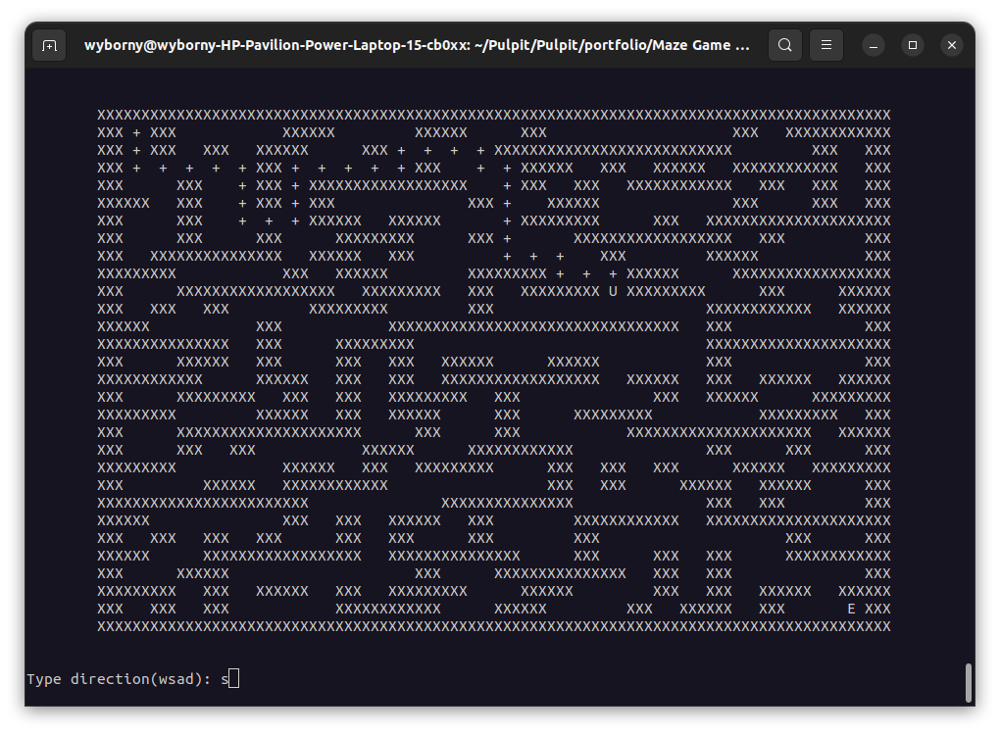
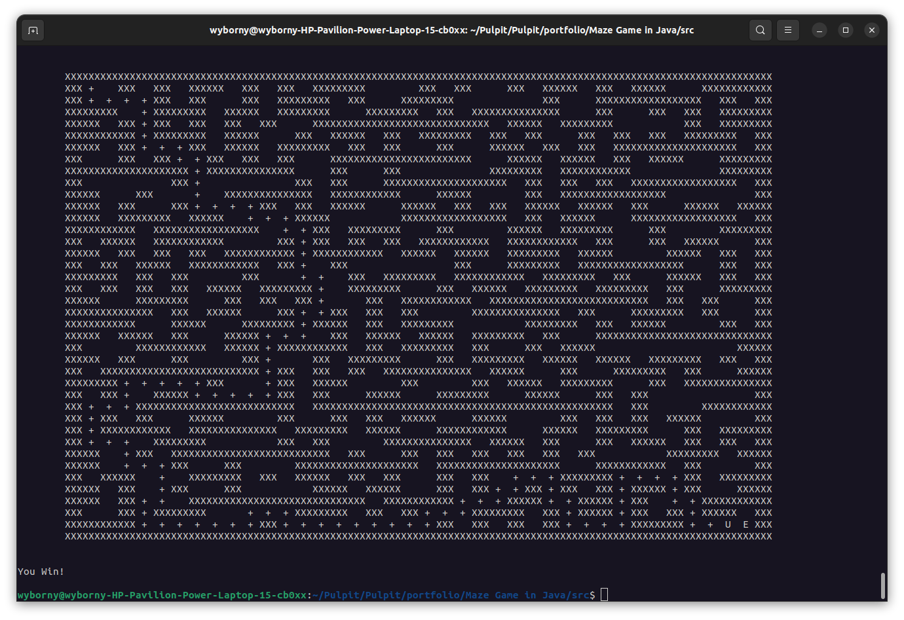

# Maze Game

## What was the purpose of writing this program
I wanted to work with 2d arrays a bit and write a method that will generate a random maze.

## What program is do
The program is generating a maze and after that user can solve this maze by using _wsad_ keys. To move player have to
type one of _wsad_ keys and press enter. You can pass an argument in console and change edge size of maze(between 15 and 50). Default edge size is 20.
# Keys:
**w** + **enter** - go up \
**s** + **enter** - go down \
**a** + **enter** - go left \
**d** + **enter** - go right

_And here screenshot how it's look like_ \

_And win_ \

